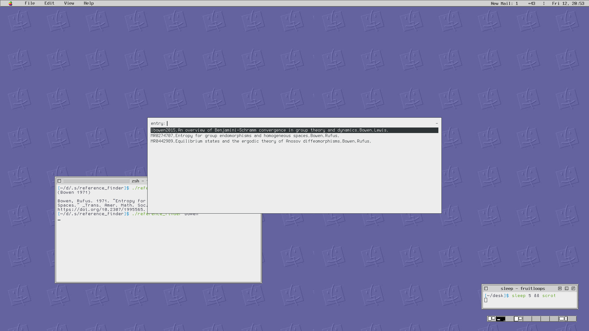

# reference_finder
Grab bibtex entries and print in plain text

# dependencies
* latex + biblatex
* pandoc
* pandoc-citeproc
* rofi
* jq


```
usage: reference_finder (search term) [AND [search terms]]
```

or, to search for anything

```
reference_finder .
```

To specify the bibfile, set `$BIBFILE`, either with `export` or by running

```
BIBFILE=$WEIRD_PATH reference_finder analysis rudin
```

The default `$bibfile` variable is also set in `reference_finder`, and you can just change that directly.

# screenshot


